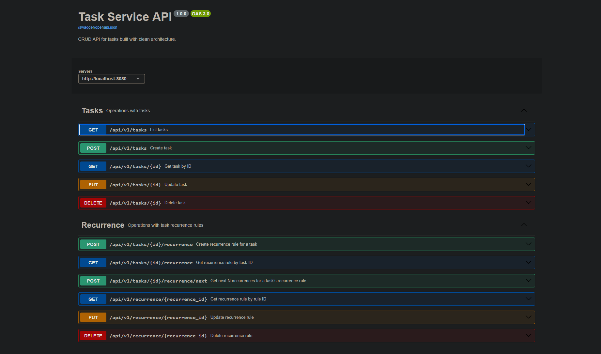
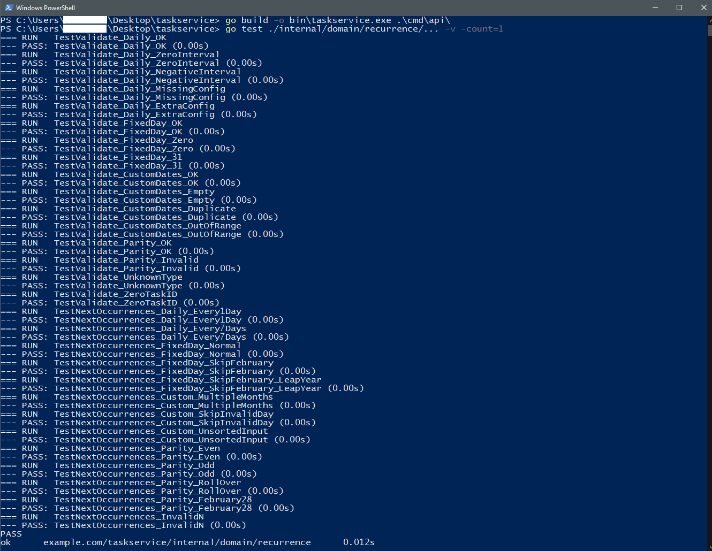
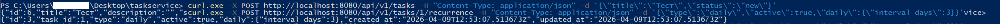

# Трекер задач с реализованной периодичностью исполнения задач
Тестовое задание

<p align="left">
  
  
  
  
</p>

---

## Содержание

1. [Архитектура и модель данных](#1-архитектура-и-модель-данных)
2. [Обоснование архитектурных решений](#2-обоснование-архитектурных-решений)
3. [Правила валидации и стратегия edge-case](#3-правила-валидации-и-стратегия-edge-case)
4. [Интеграция с API](#4-интеграция-с-api)
5. [Примеры использования](#5-примеры-использования)
6. [Ограничения и точки расширения](#6-ограничения-и-точки-расширения)
7. [Быстрый запуск](#7-быстрый-запуск)
8. [Демонстрация](#8-демонстрация)

---

## 1. Архитектура и модель данных

### 1.1 Слоёная структура (Clean Architecture)

```
cmd/api/
└── main.go                         - точка входа, wire-up зависимостей

internal/
├── domain/
│   ├── task/
│   │   ├── task.go                 - доменная модель задачи
│   │   └── errors.go               - ошибки задачи
│   └── recurrence/
│       ├── recurrence.go           - доменная модель, типы, scheduling-логика
│       ├── errors.go               - доменные ошибки
│       └── recurrence_test.go      - unit-тесты scheduling

├── usecase/
│   ├── task/
│   │   ├── ports.go                - интерфейсы Repository и Usecase
│   │   ├── service.go              - CRUD-логика задач
│   │   └── errors.go               - usecase-уровневые ошибки
│   └── recurrence/
│       ├── ports.go                - интерфейсы Repository и Usecase
│       ├── service.go              - бизнес-логика правил
│       └── errors.go               - usecase-уровневые ошибки

├── repository/postgres/
│   ├── task_repository.go          - PostgreSQL CRUD задач
│   └── recurrence_repository.go    - PostgreSQL CRUD правил

├── transport/http/
│   ├── router.go                   - регистрация маршрутов
│   ├── docs/
│   │   ├── handler.go              - Swagger UI
│   │   └── openapi.json            - спецификация OpenAPI 3.0
│   └── handlers/
│       ├── dto.go                  - DTO для задач
│       ├── task_handler.go         - HTTP-хэндлеры задач
│       ├── recurrence_dto.go       - DTO для рекуррентности
│       └── recurrence_handler.go   - HTTP-хэндлеры рекуррентности

└── infrastructure/postgres/
    └── pool.go                     - подключение к БД (pgxpool)

migrations/
├── 0001_create_tasks.up.sql        - таблица tasks
└── 0002_create_task_recurrence_rules.up.sql  - таблица task_recurrence_rules

├── screenshots/                            - демонстрационные скриншоты
├── go.mod                                  - зависимости и имя модуля
├── go.sum                                  - контрольные суммы зависимостей
├── Dockerfile                              - инструкция сборки Docker-образа
├── docker-compose.yml                      - запуск приложения с PostgreSQL
├── .gitignore                              - исключения для git
├── .dockerignore                           - исключения для Docker
└── README.md                               - Вы находитесь здесь :)
```

Каждый слой зависит **только от слоёв ниже по иерархии** через интерфейсы. Domain не знает ни о базе данных, ни о HTTP.

---

### 1.2 Доменная модель

#### Дискриминированный союз `Type`

```go
type Type string

const (
    TypeDaily              Type = "daily"
    TypeMonthlyFixedDay    Type = "monthly_fixed_day"
    TypeMonthlyCustomDates Type = "monthly_custom_dates"
    TypeMonthlyParity      Type = "monthly_parity"
)
```

Именованный строковый тип вместо `iota`-enum: JSON-сериализация остаётся читаемой, значения стабильны при реструктуризации кода.

#### Aggregate Root `Rule`

```go
type Rule struct {
    ID              int64
    TaskID          int64
    Type            Type
    Active          bool

    // Ровно одно поле не nil (соответствует Type)
    Daily           *DailyConfig
    MonthlyFixedDay *MonthlyFixedDayConfig
    MonthlyCustom   *MonthlyCustomConfig
    MonthlyParity   *MonthlyParityConfig

    CreatedAt time.Time
    UpdatedAt time.Time
}
```

Инвариант «ровно одно стратегическое поле не nil» проверяется методом `Validate()` на уровне домена и дублируется `CHECK`-ограничением в БД.

#### Конфигурации стратегий

| Тип | Структура | Ключевые поля |
|-----|-----------|---------------|
| `daily` | `DailyConfig` | `IntervalDays int` (≥ 1) |
| `monthly_fixed_day` | `MonthlyFixedDayConfig` | `Day int` (1–30) |
| `monthly_custom_dates` | `MonthlyCustomConfig` | `Days []int` (1–30, без дублей) |
| `monthly_parity` | `MonthlyParityConfig` | `Parity "even"|"odd"` |

---

### 1.3 Схема базы данных

```sql
CREATE TABLE task_recurrence_rules (
    id                          BIGSERIAL PRIMARY KEY,
    task_id                     BIGINT      NOT NULL REFERENCES tasks(id) ON DELETE CASCADE,
    type                        TEXT        NOT NULL,
    active                      BOOLEAN     NOT NULL DEFAULT TRUE,
    daily_config                JSONB       NULL,
    monthly_fixed_day_config    JSONB       NULL,
    monthly_custom_dates_config JSONB       NULL,
    monthly_parity_config       JSONB       NULL,
    created_at                  TIMESTAMPTZ NOT NULL DEFAULT NOW(),
    updated_at                  TIMESTAMPTZ NOT NULL DEFAULT NOW(),
    CONSTRAINT uq_task_recurrence_rules_task_id UNIQUE (task_id),
    CONSTRAINT chk_recurrence_single_strategy CHECK (
        (daily_config IS NOT NULL)::INT +
        (monthly_fixed_day_config IS NOT NULL)::INT +
        (monthly_custom_dates_config IS NOT NULL)::INT +
        (monthly_parity_config IS NOT NULL)::INT = 1
    ),
    CONSTRAINT chk_recurrence_type CHECK (
        type IN ('daily', 'monthly_fixed_day', 'monthly_custom_dates', 'monthly_parity')
    )
);
```

**Почему отдельные JSONB-колонки вместо одной `config JSONB`?**
Каждая стратегия имеет разную схему. Отдельные колонки позволяют создавать GIN-индексы, читать DDL без декодирования JSON и гарантировать через CHECK-ограничение, что ровно одна стратегия активна.

---

## 2. Обоснование архитектурных решений

### 2.1 Scheduling-логика в доменном слое

Метод `Rule.NextOccurrences()` размещён непосредственно в domain-объекте (Rich Domain Model): объект сам знает правила своего поведения. Usecase-слой лишь делегирует вызов после проверки бизнес-правил.

### 2.2 Стратегия «skip» для несуществующих дней

Для `monthly_fixed_day` и `monthly_custom_dates` дни, которых нет в месяце (например, 30 февраля), **пропускаются**, а не сдвигаются.

- **Альтернатива «clamp»** (сдвиг на последний день месяца): 28 февраля получало бы задачи, назначенные на 28, 29 и 30-е - нежелательное накопление.
- **Skip-семантика** сохраняет детерминизм: одна конфигурация => однозначный список дат.
- В МИС-контексте пропущенный запуск безопаснее, чем непредвиденное накопление нескольких запусков в одну дату.

Реализовано через проверку overflow: `time.Date(year, Feb, 30, ...)` нормализует дату в март - обнаруженное несоответствие месяца возвращает нулевое `time.Time{}`, планировщик его игнорирует.

### 2.3 Ограничение дней до 30

`maxConfiguredDay = 30` исключает день 31 - конфигурация «запускать 31-го» срабатывала бы лишь в 7 из 12 месяцев. Если потребуется, достаточно изменить константу и добавить тест.

### 2.4 Один-к-одному: задача => правило

`UNIQUE (task_id)` гарантирует отсутствие конкурирующих расписаний. Нарушение маппируется в `ErrTaskAlreadyHasRule` (HTTP 409).

### 2.5 Часовые пояса

Все метки хранятся и вычисляются в UTC. `TIMESTAMPTZ` в PostgreSQL через pgx всегда возвращает UTC. DST не влияет на вычисления. Конвертация в локальный timezone - ответственность клиента.

### 2.6 Инъекция `now func() time.Time`

Функция текущего времени инжектируется в Service, а не вызывается напрямую `time.Now()` - стандартный паттерн для детерминированного тестирования.

---

## 3. Правила валидации и стратегия edge-case

### 3.1 Полная матрица валидации

| Поле | Правило | Сообщение |
|------|---------|-----------|
| `task_id` | > 0 | `task_id must be a positive integer` |
| `type` | один из 4 значений | `unsupported recurrence type "X"` |
| `daily.interval_days` | ≥ 1 | `daily.interval_days must be ≥ 1` |
| `monthly_fixed_day.day` | 1–30 | `monthly_fixed_day.day must be between 1 and 30` |
| `monthly_custom_dates.days` | непустой | `must contain at least one day` |
| `monthly_custom_dates.days[i]` | 1–30 | `each day must be between 1 and 30` |
| `monthly_custom_dates.days` | без дублей | `duplicate day X` |
| `monthly_parity.parity` | `"even"` или `"odd"` | `parity must be 'even' or 'odd'` |
| стратегические блоки | ровно один | `only the 'X' config block must be present` |
| `n` (NextOccurrences) | 1–365 | `n must be a positive integer` / `n must not exceed 365` |

### 3.2 Календарные edge-cases

| Сценарий | Поведение |
|----------|-----------|
| Февраль 2026 (28 дней) + день 30 | Месяц пропускается |
| Февраль 2028 (29 дней, високосный) + день 30 | Месяц пропускается |
| Custom `[1, 15, 30]` в феврале | Дни 1 и 15 - выполняются, 30 - пропускается |
| Parity-even, февраль 28 дней | Последний чётный день: 28 |
| `from` с ненулевым временем | Усекается до midnight UTC |
| `from` в другом timezone | Принудительно конвертируется в UTC |

### 3.3 Атомарность обновления

`UpdateRule` полностью заменяет конфигурацию стратегии. Partial-update не поддерживается: частичное изменение создаёт риск временно невалидного состояния (тип сменился, конфиг старый). Полная замена: единственная транзакционно безопасная семантика.

---

## 4. Интеграция с API

### 4.1 Базовый префикс

```
/api/v1
```

### 4.2 Эндпоинты рекуррентности

| Метод | Путь | Описание |
|-------|------|----------|
| `POST` | `/api/v1/tasks/{id}/recurrence` | Создать правило для задачи |
| `GET` | `/api/v1/tasks/{id}/recurrence` | Получить правило задачи |
| `POST` | `/api/v1/tasks/{id}/recurrence/next` | Вычислить следующие N дат |
| `GET` | `/api/v1/recurrence/{recurrence_id}` | Получить правило по его ID |
| `PUT` | `/api/v1/recurrence/{recurrence_id}` | Обновить правило |
| `DELETE` | `/api/v1/recurrence/{recurrence_id}` | Удалить правило |

### 4.3 Коды ответов

| Код | Ситуация |
|-----|----------|
| 200 | Успешное получение / обновление |
| 201 | Успешное создание |
| 204 | Успешное удаление |
| 400 | Невалидный ввод |
| 404 | Правило или задача не найдены |
| 409 | Задача уже имеет правило рекуррентности |
| 500 | Внутренняя ошибка сервера |

### 4.4 Формат ошибок

```json
{ "error": "описание ошибки" }
```

---

## 5. Примеры использования

### 5.1 Daily: каждые 3 дня

```bash
curl -X POST http://localhost:8080/api/v1/tasks/1/recurrence \
  -H "Content-Type: application/json" \
  -d '{"type":"daily","active":true,"daily":{"interval_days":3}}'
```

Ответ:
```json
{
  "id": 1,
  "task_id": 1,
  "type": "daily",
  "active": true,
  "daily": { "interval_days": 3 },
  "created_at": "2026-04-08T12:00:00Z",
  "updated_at": "2026-04-08T12:00:00Z"
}
```

### 5.2 Monthly Fixed Day: каждое 15-е число

```bash
curl -X POST http://localhost:8080/api/v1/tasks/2/recurrence \
  -H "Content-Type: application/json" \
  -d '{"type":"monthly_fixed_day","active":true,"monthly_fixed_day":{"day":15}}'
```

### 5.3 Monthly Custom Dates: 1-е, 10-е и 20-е числа

```bash
curl -X POST http://localhost:8080/api/v1/tasks/3/recurrence \
  -H "Content-Type: application/json" \
  -d '{"type":"monthly_custom_dates","active":true,"monthly_custom_dates":{"days":[1,10,20]}}'
```

### 5.4 Monthly Parity: только нечётные дни

```bash
curl -X POST http://localhost:8080/api/v1/tasks/4/recurrence \
  -H "Content-Type: application/json" \
  -d '{"type":"monthly_parity","active":true,"monthly_parity":{"parity":"odd"}}'
```

### 5.5 Получить следующие 5 дат запуска

```bash
curl -X POST http://localhost:8080/api/v1/tasks/1/recurrence/next \
  -H "Content-Type: application/json" \
  -d '{"from":"2026-04-08T00:00:00Z","n":5}'
```

Ответ (daily, interval_days=3):
```json
{
  "task_id": 1,
  "occurrences": [
    "2026-04-11T00:00:00Z",
    "2026-04-14T00:00:00Z",
    "2026-04-17T00:00:00Z",
    "2026-04-20T00:00:00Z",
    "2026-04-23T00:00:00Z"
  ]
}
```

### 5.6 Обновить правило (сменить тип)

```bash
curl -X PUT http://localhost:8080/api/v1/recurrence/1 \
  -H "Content-Type: application/json" \
  -d '{"type":"monthly_parity","active":true,"monthly_parity":{"parity":"even"}}'
```

### 5.7 Деактивировать правило

`NextOccurrences` для неактивного правила возвращает пустой список без ошибки:

```json
{ "task_id": 1, "occurrences": [] }
```

### 5.8 Запуск тестов

```bash
go test ./internal/domain/recurrence/... -v -count=1
```

Покрытые сценарии: валидация всех 4 типов, daily (1 и 7 дней), FixedDay (нормальный, февраль, високосный год), Custom (несколько месяцев, пропуск невалидного дня, несортированный ввод), Parity (even/odd, перенос через конец месяца, февраль 28 дней).

---

## 6. Ограничения и точки расширения

### 6.1 Текущие ограничения

| Ограничение | Способ снятия |
|-------------|---------------|
| Максимальный день: 30 | Изменить `maxConfiguredDay = 31`, добавить тест |
| Одно правило на задачу | Убрать `UNIQUE (task_id)`, добавить приоритеты |
| `n ≤ 365` | Конфигурировать через env-переменную |
| Нет интеграционных тестов репозитория | Добавить `testcontainers-go` |

### 6.2 Добавление нового типа рекуррентности (например, `weekly`)

1. Добавить `TypeWeekly` в `domain/recurrence/recurrence.go`
2. Добавить `WeeklyConfig` и поле в `Rule`
3. Добавить case в `Validate()` и `NextOccurrences()`
4. Добавить JSONB-колонку в миграции
5. Обновить `ruleToColumns` / `scanRule`

Слои usecase, transport и router **не требуют изменений** - демонстрация принципа OCP.

### 6.3 Принятые допущения

1. **Timezone policy**: UTC-only; клиент отвечает за конвертацию при отображении
2. **Аутентификация**: вне scope модуля; предполагается API Gateway / middleware
3. **ON DELETE CASCADE**: удаление задачи удаляет правило; при необходимости аудита - заменить на soft-delete с `deleted_at TIMESTAMPTZ`
4. **Формат дат**: RFC 3339 (соответствует стандарту HL7 FHIR для МИС)
5. **Горизонт планирования**: не более 365 дат за один запрос

---

## 7. Быстрый запуск

```bash
# Запуск через Docker Compose
docker compose up --build

# Swagger UI
open http://localhost:8080/swagger/

# Создать задачу
curl -X POST http://localhost:8080/api/v1/tasks \
  -H "Content-Type: application/json" \
  -d '{"title":"Инвентаризация медикаментов","status":"new"}'

# Добавить расписание: каждые 7 дней
curl -X POST http://localhost:8080/api/v1/tasks/1/recurrence \
  -H "Content-Type: application/json" \
  -d '{"type":"daily","active":true,"daily":{"interval_days":7}}'

# Получить следующие 4 запуска
curl -X POST http://localhost:8080/api/v1/tasks/1/recurrence/next \
  -H "Content-Type: application/json" \
  -d '{"n":4}'

# Запустить unit-тесты
go test ./internal/domain/recurrence/... -v -count=1
```

---

## 8. Демонстрация

### Swagger UI: все 11 эндпоинтов


### Сборка и тесты: все прошли успешно


### Создание задачи и правила рекуррентности


### Расчёт следующих дат запуска

